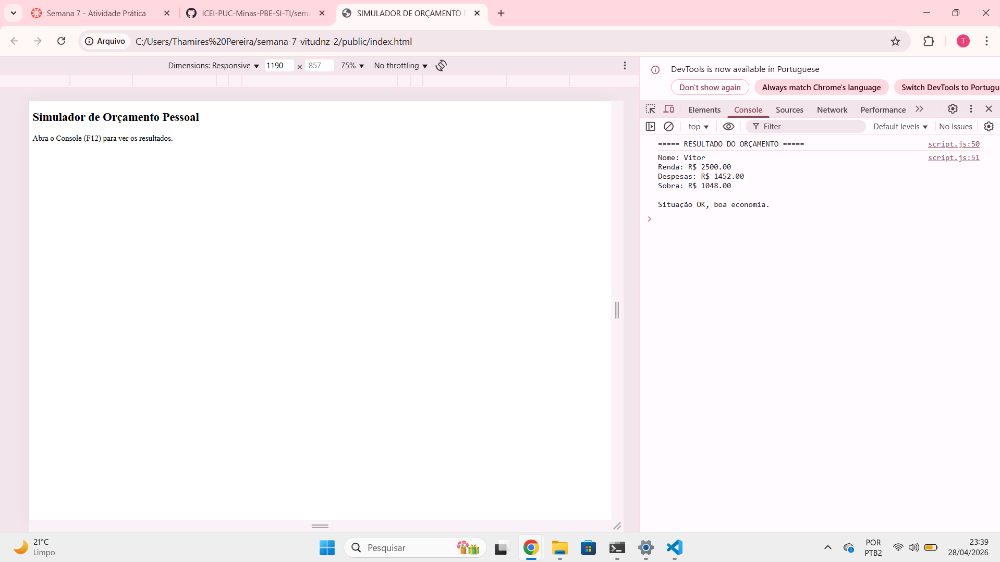
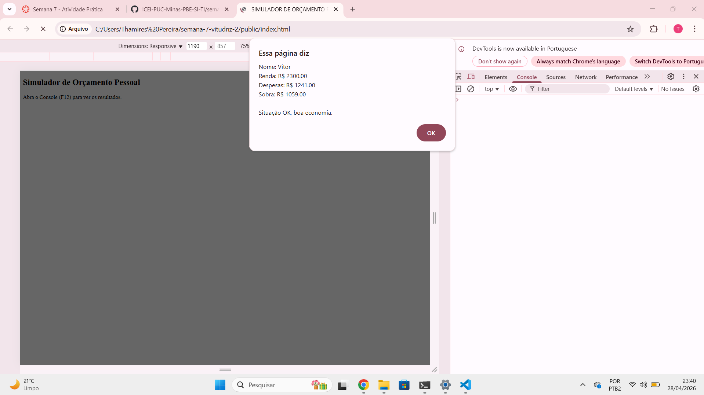

# Trabalho Prático - Semana 7

Nesta atividade, você dará os primeiros passos com JavaScript, explorando na prática a criação de variáveis, o uso de tipos de dados básicos (string, number e boolean), operadores, além de estruturas de controle de fluxo, como condicionais e laços de repetição (for e while).

## Informações Gerais

- Nome: Vitor Fernandes Diniz
- Matrícula: 1209348

## Print do console do navegador

(*) Utilize as ferramentas do desenvolvedor do seu navegador para colocar no modo responsivo, escolha um celular qualquer e recarregue a página antes de tirar o print. 